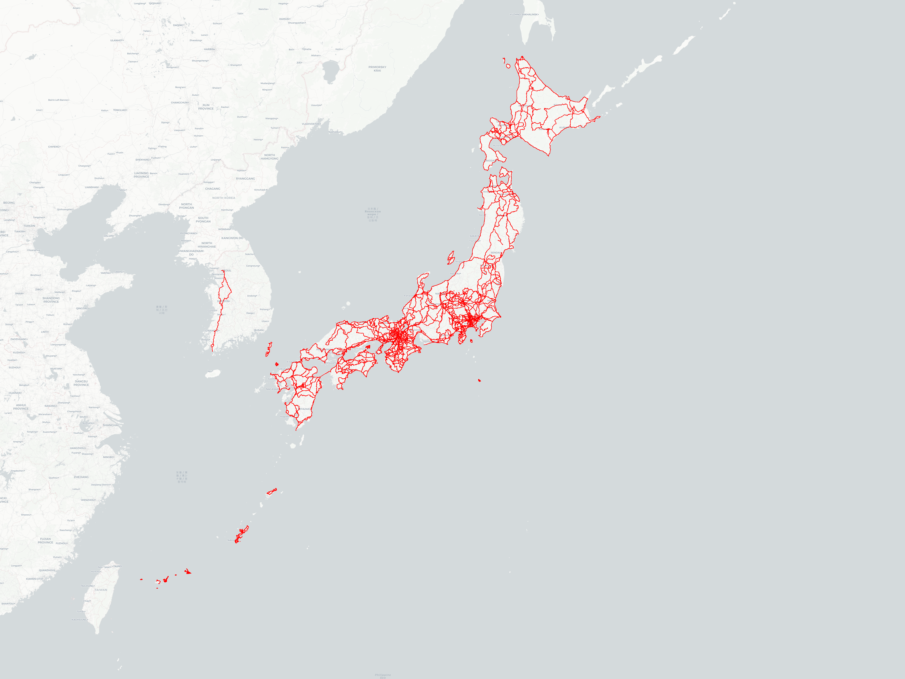

# ActivityPlotter CLI

複数のアクティビティルートファイル（GPX, FIT, TCXファイル、およびそれらのGZIP圧縮ファイル）を読み込み、位置情報（緯度・経度）を抽出して、指定されたサイズの世界地図画像（PNG形式）上にルートの軌跡を描画する Node.js 製のCLIツールです。

ベースとなる地図には OpenStreetMap (OSM) のタイルを利用します。



## 特徴

* **複数フォーマット対応**: `.gpx`, `.fit`, `.tcx` に対応。
* **圧縮ファイル対応**: `.gz` で圧縮されたルートファイルもオンメモリで透過的に解凍・読み込み可能。
* **Zwiftデータ除外**: FITファイル解析時、仮想アクティビティであるZwiftのデータは自動的に除外（スキップ）されます。
* **複数スタイルの切り替え**: `--style` オプションで、基本的な地図(osm)、ダークテーマ(dark)、ライトテーマ(light)を選択可能。
* **自動バウンディングボックス**: デフォルトで、入力された全ルートがぴったり収まるように地図の描画範囲（ズームレベル）を自動計算して描画します。全体を描画したい場合は `--no-bbox` オプションを指定してください。
* **日本全体表示**: `--japan` オプションで、日本全体（与那国島〜択捉島）を固定表示する地図を生成できます。
* **大規模データ対応**: 数万点の座標を持つ長時間のログデータでも、コールスタックオーバーフローを起こさないよう最適化されたチャンク描画処理を実装しています。
* **カスタマイズ可能な描画**: コマンドライン引数から軌跡の線の色（RGB）や不透明度（アルファ値）を細かく指定できます。

## 動作環境

* Node.js (v14以上推奨)

## インストール

依存パッケージをインストールします。

```bash
npm install
```

## 使い方

以下のコマンド例を参考に、CLIを実行してください。

```bash
# ヘルプと利用可能なオプションの確認
node index.js --help

# 基本的な使い方 (自動ズーム適用)
# (例: my_routes フォルダ内の ルートファイル を my_map.png として出力)
node index.js --input ./my_routes --output ./my_map.png

# 出力画像のサイズを明示的に指定する場合
node index.js --input ./my_routes --output ./my_map.png --width 1920 --height 1080

# 線の色、スタイルの指定
# -c: RGB値 (例: 255,0,0 は赤、0,255,100は黄緑) 初期値は 0,0,255 (青)
# -a: 不透明度 (0.0 〜 1.0) 初期値は 0.8
# -s: 地図のスタイル (osm, dark, light) 初期値は osm
node index.js --input ./my_routes --output ./my_map.png -c 0,255,100 -a 0.8 -s dark

# 日本全体のみを描画
node index.js --input ./my_routes --output ./my_map.png --japan
```

### オプション一覧

| オプション | 短縮形 | 必須 | 説明 | デフォルト値 |
| :--- | :--- | :---: | :--- | :--- |
| `--input <dir>` | `-i` | 必須 | ルートファイル (.gpx, .fit, .tcx, .gz) が含まれる入力ディレクトリのパス | |
| `--output <file>`| `-o` | 必須 | 出力するPNG画像ファイルのパスとファイル名 | |
| `--width <number>`| `-w` | | 出力画像の幅（ピクセル） | `1920` |
| `--height <number>`| `-h` | | 出力画像の高さ（ピクセル） | `1440` |
| `--color <string>`| `-c` | | 線の色をRGB値（カンマ区切り）で指定 | `0,0,255` (青) |
| `--alpha <number>`| `-a` | | 線の不透明度を 0.0〜1.0 の範囲で指定 | `0.8` |
| `--style <string>`| `-s` | | 地図のスタイル（`osm`, `dark`, `light`） | `osm` |
| `--bbox` | `-b` | | 入力された全ルートが収まる領域を自動計算して描画します | `true` (デフォルト) |
| `--no-bbox` | `-B` | | バウンディングボックスの自動計算を無効にし、世界地図全体を描画します | |
| `--japan` | `-j` | | 日本全体を固定範囲で描画します | `false` |

## ファイル読み込みの進捗
実行時、指定されたディレクトリ内の対象ファイル数をカウントし、「`ファイルの読み込み完了数/全体数`」の形式でコンソールへ進捗状況を表示します。

## ライセンス

[GNU General Public License v3.0 (GPLv3)](LICENSE)
